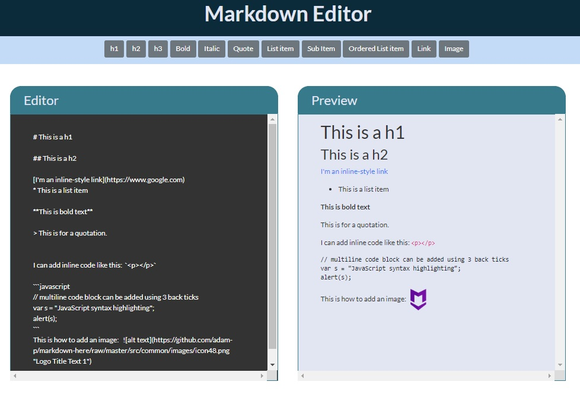

# Markdown Previewer

##  Technology: ReactJS, Marked.js

### Description

The user is presented with an editor and preview area. 
When the user enters text into the editor, the previewer is updated as the user types.

https://sonnerz.github.io/Markdown-Previewer

A Pen is created at CodePen.io: https://codepen.io/sonnerz/full/XQgZPE

